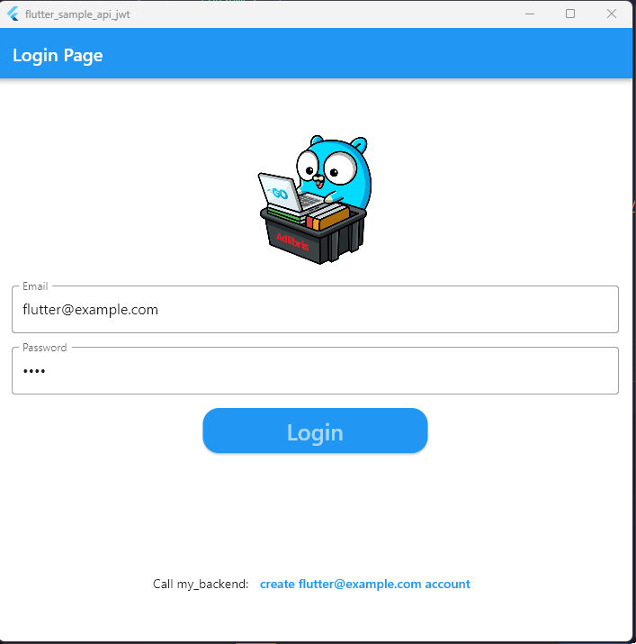

<!-- Improved compatibility of back to top link: See: https://github.com/vinpel/flutter_sample_api_jwt/pull/73 -->

<!--
*** Thanks for checking out the Best-README-Template. If you have a suggestion
*** that would make this better, please fork the repo and create a pull request
*** or simply open an issue with the tag "enhancement".
*** Don't forget to give the project a star!
*** Thanks again! Now go create something AMAZING! :D
-->

<!-- PROJECT SHIELDS -->
<!--
*** I'm using markdown "reference style" links for readability.
*** Reference links are enclosed in brackets [ ] instead of parentheses ( ).
*** See the bottom of this document for the declaration of the reference variables
*** for contributors-url, forks-url, etc. This is an optional, concise syntax you may use.
*** https://www.markdownguide.org/basic-syntax/#reference-style-links
-->

[![Issues][issues-shield]][issues-url]
[![MIT License][license-shield]][license-url]
[![LinkedIn][linkedin-shield]][linkedin-url]

<!-- PROJECT LOGO -->
 

  

  <h3 align="center">flutter_sample_api_jwt</h3>

  

    A simple, structured, flutter app to interact with the golang backend to log user, create user, change password with JWT security  
    <a href="https://github.com/vinpel/golang-sample-api-jwt">golang-sample-api-jwt</a>  
    <a href="https://github.com/vinpel/flutter_sample_api_jwt/issues">Report Bug</a>
    ·
    <a href="https://github.com/vinpel/flutter_sample_api_jwt/issues">Request Feature</a>
  

<!-- TABLE OF CONTENTS -->

  
Table of Contents

  <ol>
    <li><a href="#about-the-project">About The Project</a></li> 
    <li><a href="#Screenshot">Screenshot</a></li>
    <li><a href="#prerequisites">Prerequisites</a></li>
    <li><a href="#roadmap">Roadmap</a></li>
    <li><a href="#contributing">Contributing</a></li>
    <li><a href="#license">License</a></li>
    <li><a href="#contact">Contact</a></li>
    <li><a href="#acknowledgments">Acknowledgments</a></li>
    <li><a href="#flutter-packages">Flutter packages</a></li>
    
  </ol>

<!-- ABOUT THE PROJECT -->
## About The Project

This flutter application does the following things :
 * Display a an email/password screen if no jwt token stored.
 * Automacly log the user if a accessToken or refreshToken is still valid
 * Allow logged user to logout (destroy tokens)
 * Allow user to create a new user
 * Allow user to change password
 * Allow user to access the JWT secured resource "ping"

 To test the ping resource without identification, change the password with the checkbox checked for your account.

(<a href="#readme-top">back to top</a>)

## Screenshot

*Login Page:*

*Home Page*

*Create user page*

*Change Password*

(<a href="#readme-top">back to top</a>)

<!-- GETTING STARTED -->
## Prerequisites

* flutter
* a running application "golang-sample-api-jwt" on "localhost:8000"

<!-- ROADMAP -->
## Roadmap

- [x] Login and store JWT token in flutter_secure
- [x] Use the JWT via an interceptor in HTTP Header for **Ping Secure**
- [ ] Gracefully report API return error
- [ ] Use the onError interceptor
- [ ] Redirect to the login page if HTTPcode = 400 or 401 (*empreinte* changed for example)
- [ ] Do somes test

See the [open issues](https://github.com/vinpel/flutter_sample_api_jwt/issues) for a full list of proposed features (and known issues).

(<a href="#readme-top">back to top</a>)

<!-- CONTRIBUTING -->
## Contributing

Contributions are what make the open source community such an amazing place to learn, inspire, and create. Any contributions you make are **greatly appreciated**.

If you have a suggestion that would make this better, please fork the repo and create a pull request. You can also simply open an issue with the tag "enhancement".
Don't forget to give the project a star! Thanks again!

1. Fork the Project
2. Create your Feature Branch (`git checkout -b feature/AmazingFeature`)
3. Commit your Changes (`git commit -m 'Add some AmazingFeature'`)
4. Push to the Branch (`git push origin feature/AmazingFeature`)
5. Open a Pull Request

(<a href="#readme-top">back to top</a>)

<!-- LICENSE -->
## License

Distributed under the MIT License. See `LICENSE.txt` for more information.

(<a href="#readme-top">back to top</a>)

<!-- CONTACT -->
## Contact

Vincent Pélisset - [@g4spine](https://twitter.com/g4spine) 

Project Link: [https://github.com/vinpel/flutter_sample_api_jwt](https://github.com/flutter_sample_api_jwt)

(<a href="#readme-top">back to top</a>)

<!-- ACKNOWLEDGMENTS -->
## Acknowledgments

* [Best-README-Template](https://github.com/othneildrew/Best-README-Template)
* [Gopher image](https://dribbble.com/shots/18090283-Gopher-with-Laptop)
* [https://github.com/yogitakumar/logindemo](https://github.com/yogitakumar/logindemo)

(<a href="#readme-top">back to top</a>)

<!-- MARKDOWN LINKS & IMAGES -->
<!-- https://www.markdownguide.org/basic-syntax/#reference-style-links -->
[issues-shield]: https://img.shields.io/github/issues/vinpel/flutter_sample_api_jwt.svg?style=for-the-badge
[issues-url]: https://github.com/vinpel/flutter_sample_api_jwt/issues
[license-shield]: https://img.shields.io/github/license/vinpel/flutter_sample_api_jwt.svg?style=for-the-badge
[license-url]: https://github.com/vinpel/flutter_sample_api_jwt/blob/master/LICENSE.txt

## Flutter packages

* DIO : https://pub.dev/packages/dio
* ndialog : https://pub.dev/packages/ndialog
* flutter_secure_storage : https://pub.dev/packages/flutter_secure_storage
* jwt_decoder : https://pub.dev/packages/jwt_decoder
